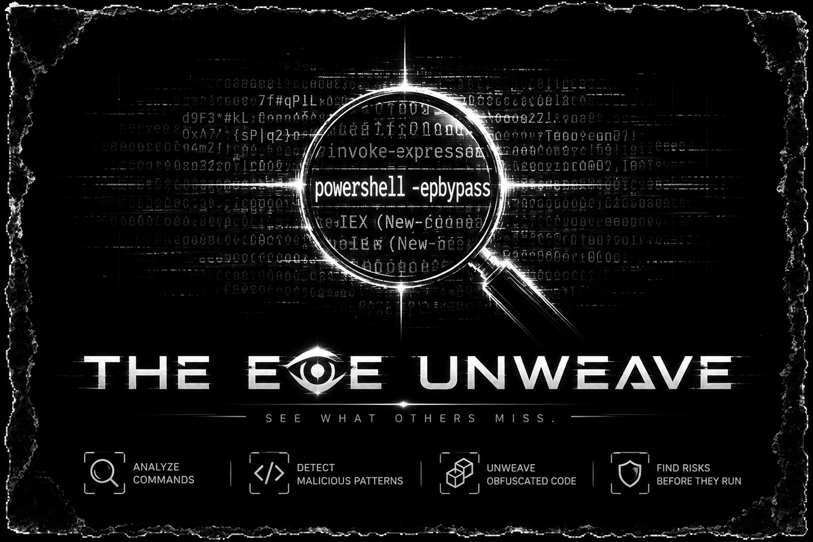
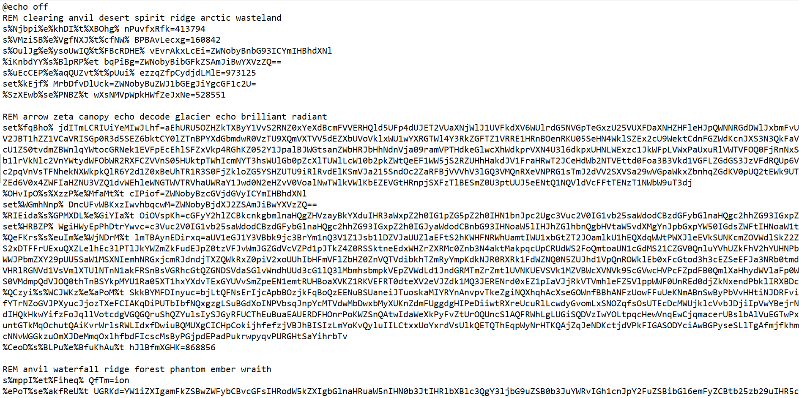
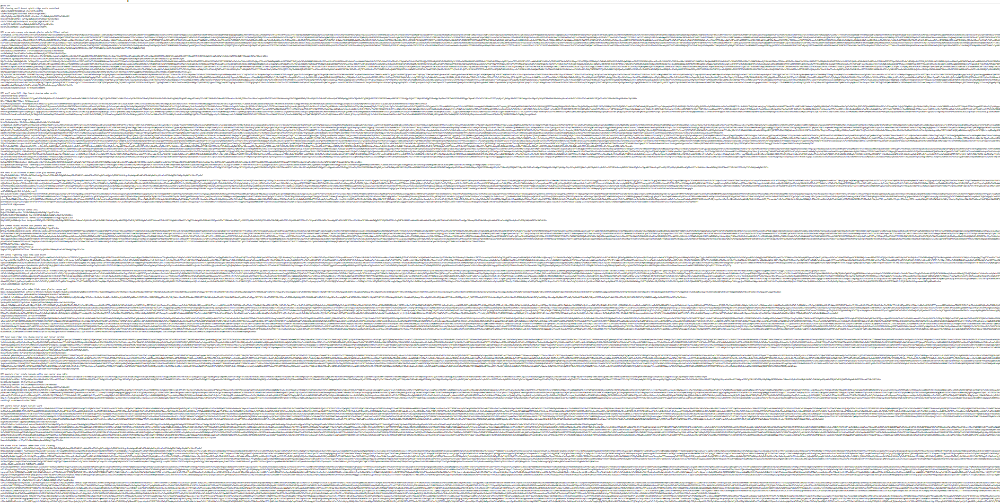

# UNWEAVE

**NOISEWEAVE batch deobfuscator**


UNWEAVE detects and reverses the **NOISEWEAVE** obfuscation pattern — a name
*we gave* to a home-grown batch-obfuscation style seen in malware such as
`galaxy.bat`. It stitches together the real commands hidden behind fractured
`set` assignments and `%VAR%` substitution, then emits a clean, readable version.

No execution of the target file is performed. Static analysis only.



## What is NOISEWEAVE?

> **Note:** `NOISEWEAVE` is **not** an officially registered obfuscation name.
> It is a name **we coined** for this specific batch-obfuscation pattern, because
> it has no known public designation. The pattern is home-grown / malware-family
> specific (seen in samples such as `galaxy.bat`). We name it after what it does:
> it **weaves** the real command through a wall of **noise**.

NOISEWEAVE is a batch obfuscation technique that:

- **Fractures the `set` keyword** with noise infixes, e.g.
  ```
  s%X%e%Y%t VAR=value
  %A%se%B%t VAR=value
  se%C%t%D% VAR=value
  ```
- **Stitches the real command** through "builder" lines that concatenate
  previously-defined variables via `%VAR%` substitution, e.g.
  ```
  %AtlyQrFwj%%FbYCUaup%%ijFcdwG%...  ->  setlocal enabledelayedexpansion
  ```
- **Pads the file with dead data** (thousands of random Base64 words) to bury
  the logic and defeat casual review.
- Often **hides the payload in image pixels** (steganography) instead of the
  file itself, then loads it in-memory via `Reflection.Assembly.Load`.

## How it works

1. Parse every `set VAR=value` (plain or noise-fractured).
2. Expand every `%VAR%` on builder lines until stable.
3. Tidy common fragment collisions (`setlocalenabledelayedexpansion` →
   `setlocal enabledelayedexpansion`, `powershell.exe-epbypass` →
   `powershell.exe -epbypass`, etc.).
4. Emit a clean `.bat` and/or the decoded PowerShell payload (`.ps1`) into the
   **same directory** as the input, named `<name>_clean.<ext>`.

## Usage

```bash
python UNWEAVE.py
```

Interactive prompts:

```
============================================================
  UNWEAVE  -  NOISEWEAVE batch deobfuscator
============================================================

Path to the obfuscated .bat file: galaxy.bat

What do you want to generate?
  [1] .bat
  [2] .ps1
  [3] both
> 3
[+] Wrote clean bat : galaxy_clean.bat
[+] Wrote decoded ps1: galaxy_clean.ps1
```

Non-interactive (pipe input):

```bash
echo "galaxy.bat`n3" | python UNWEAVE.py
```



## Output

| File | Description |
|------|-------------|
| `<name>_clean.bat` | The deobfuscated batch commands only |
| `<name>_clean.ps1` | The extracted PowerShell payload (from `-c "..."`) |

Output is always written to the **same directory** as the input file.

## Example



Input `galaxy.bat` (1670 lines, ~600 KB of noise) deobfuscates to:

```bat
setlocal enabledelayedexpansion
echo off
start conhost.exe --headless powershell.exe -epbypass -w h -c "<payload>"
exit /b
```

## Warning

UNWEAVE only **reads and decodes**. It never runs the target or its payload.
Review the generated files — do not execute them blindly.